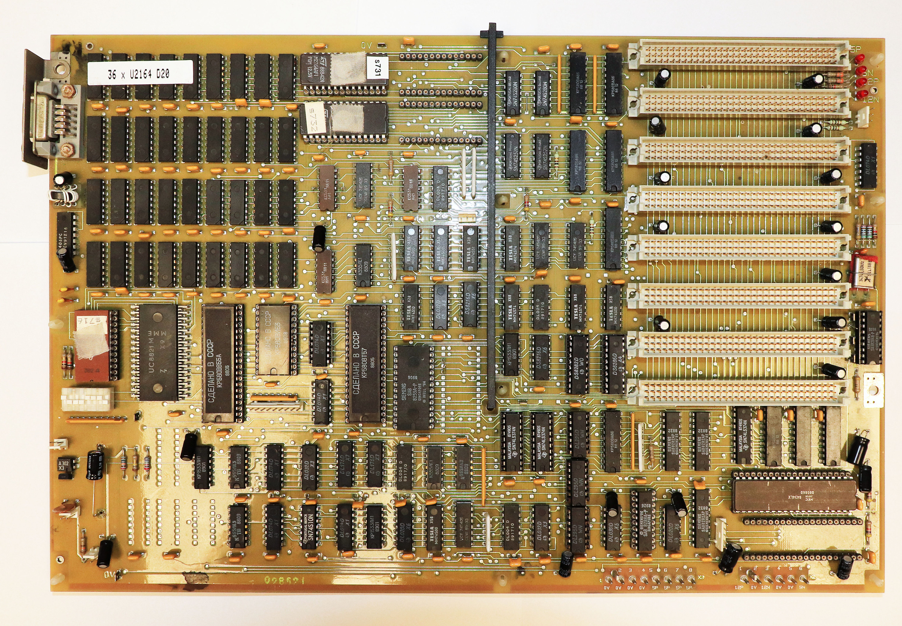
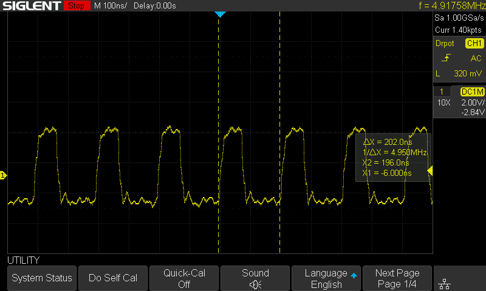

# Mainboard

Die Überprüfung (und Reparatur) des Mainboards dürfte die aufwendigste Arbeit sein.
Es gibt potentiell viele Fehlerquellen.

### optische Kontrolle
An erster Stelle sollte eine optische Kontrolle des Mainboard stattfinden, ob es hier offensichtliche Defekte gibt.
Leiterbahnen, ausgelaufene Akkus (nicht beim 1834, aber auch Elkos), Korrosion, defekte Kondensatoren...

### Spannungsversorgung
Der nächste Schritt ist eine Widerstands-Messung an den Stromversorgungsanschlüssen.

Zwischen GND und den 5P, 5N, 12P und 12N sollte kein Kurzschluss sein.
Meine Messungen ergaben hier Werte zwischen 300 und 50 Ohm bei GND-5P. Bei der erwarteten Leistung dürfte der reale Widerstand aber deutlich niedriger sein.

Eine Frage die mir keiner beantworten konnte ist: Wie hoch ist der 5P Strombedarf für das nackte 1834 Mainboard?

Die Antwort: ca 2,9A!

Ein Labornetzteil sollte daher mindestens 3,5A liefern können und diese auch im Fehlerfall begrenzen können.

Bei Anschluss eines Netzteils an 5P-GND sollte man vielleicht mit 2,8A Begrenzung anfangen. Die Spannung darf auf etwas über 4,5V einbrechen. Sollte die Spannung hier stark weiter einbrechen, liegt möglicherweise ein Kurzschluss vor.

Dieses Problem trat bei mir nicht auf. Die entsprechende Stelle dürfte eine hohe Temperatur entwickeln und müsste darüber zu lokalisieren sein.

### Systemtakt
Nun ist der Systemtakt zu überprüfen.
Bei Sicht auf das Board aus Richtung Stromanschlusses befindet sich rechts der Oszillator.

Bei Anlegen der Spannung 5P am Board sollte hier der Takt bereits messbar sein.

Sämtliche Messungen sollten über einen etwas längeren Zeitraum beobachtet werden.
Zu achten ist im Allgemeinen bei OSC auf Symmetrie, Flankensteilheit und Jitter.
Ideal wäre es, das Oszilloskop auf einen Dropout Trigger zu konfigurieren. D.h. ob der Takt stabil oder unregelmäßig ist.
Bei OSC ist eine Periode etwa 67ns lang. Bei einer Dauer von etwa 69-70ns als Dropout Trigger sollte der Trigger kein Ereignis feststellen.
Das ganze sollte ruhig auch auf CLK86 und PCLK geprüft werden, um über die Funktion vom 8284 Sicherheit zu erlangen.

Mit einem Oszilloskop sollte man hier ca 14745 KHz messen.
Die Messung könnte sich aber etwas schwierig erweisen, weil das Signal weder ein Sinus noch Rechtecksignal ist (zumindest nicht bei mir).

Der Takt des Oszillator wird am D43 [8284] verstärkt und geteilt.

Das verstärkte Signal lässt sich bei korrekter Funktion vom 8284 an D43.12 (OSC1) oder etwas besser am Messpunkt E5 abgreifen.
Hier war an meinem Oszilloskop eine genauere Messung der Frequenz möglich.

An D43.8 wird die Frequenz auf 1/3 geteilt. Dort sollte der CPU-Takt CLK86 von etwa 4915 KHz oder etwa 4,9MHz mit einem Tastverhältnis von 30% messen lassen.
Der Takt lässt sich auch einfacher an einem Pin von R3 abgreifen.

Die nächste Messung ist der Periphere Clock PCLK auf D43.2 oder auch auf R7.
Der Takt ist 1/2 von CLK86 mit einem Tastverhältnis von 50% bei 2,45MHz.

D43.12 wird als Signal OSC1 auf das Mainboard geführt. Verwendet wird es auf dem NAND D57.[1 & 2] zu D57.3
Hier sollte das Signal /OSC1 und damit D57 überprüft werden. Das negierte Signal wird dann auch gleich wieder zu D57.[8 & 9] geführt und als OSC auf D57.8 auf das Mainboard geführt.
D57.8 ist ebenfalls zu prüfen.

Falls diese Messungen in Ordnung sind, kann der Takt als funktionierend betrachtet werden.
Das Signal OSC wird nur noch auf die Slots X1.1-X1.8 auf Erweiterungskarten geführt.
